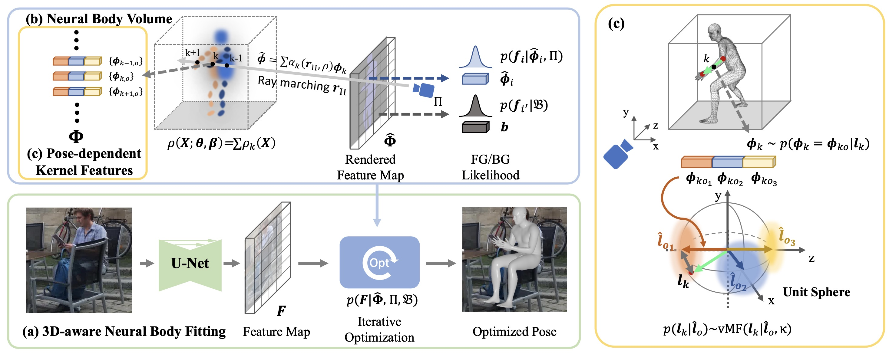

# 3D-Aware Neural Body Fitting for Occlusion Robust 3D Human Pose Estimation

<br/>

<div align="center">
    
</div>

<br/>

## Introduction

We provide the config files for 3DNBF: [3D-Aware Neural Body Fitting for Occlusion Robust 3D Human Pose Estimation](https://3dnbf.github.io). The project is based on [mmhuman3d](https://github.com/open-mmlab/mmhuman3d) codebase. Please also refer to [mmhuman3d v0.5.0](https://github.com/open-mmlab/mmhuman3d/tree/v0.5.0) if you have and confusion about the code.

```BibTeX

@Inproceedings{zhang2023nbf,
  author    = {Zhang, Yi and 
                Ji, Pengliang and 
                Kortylewski, Adam and 
                Wang, Angtian and 
                Mei, Jieru and 
                Yuille, Alan L},
  title     = {{3D-Aware Neural Body Fitting for Occlusion Robust 3D Human Pose Estimation}},
  booktitle = {The IEEE/CVF International Conference on Computer Vision},
  year      = {2023}
}

```
<!-- TOC -->

- [Installation](#installation)
- [Data Preperation](#data-preparation)
- [Evaluation](#evaluation)
- [Training](#training)
- [Demo](#demo)

<!-- TOC -->

## Installation

Please refer to [install.md](./docs/install.md) for installation.

## Data Preparation

### Fetch Data

Download [data](https://livejohnshopkins-my.sharepoint.com/:u:/g/personal/yzhan286_jh_edu/EfdBj5u9u_lPiVSQzcBhHdwBRsDyjk1xET5hFYKTGzOf5w?e=DRecfS) and unzip to `$ROOT`.

### Body Model Preparation

- [SMPL](https://smpl.is.tue.mpg.de/) v1.0 is used in our experiments.
  - Neutral model can be downloaded from [SMPLify](https://smplify.is.tue.mpg.de/).
  - All body models have to be renamed in `SMPL_{GENDER}.pkl` format. <br/>
    For example, `mv basicModel_neutral_lbs_10_207_0_v1.0.0.pkl SMPL_NEUTRAL.pkl`
- [J_regressor_extra.npy](https://openmmlab-share.oss-cn-hangzhou.aliyuncs.com/mmhuman3d/models/J_regressor_extra.npy?versionId=CAEQHhiBgIDD6c3V6xciIGIwZDEzYWI5NTBlOTRkODU4OTE1M2Y4YTI0NTVlZGM1)
- [J_regressor_h36m.npy](https://openmmlab-share.oss-cn-hangzhou.aliyuncs.com/mmhuman3d/models/J_regressor_h36m.npy?versionId=CAEQHhiBgIDE6c3V6xciIDdjYzE3MzQ4MmU4MzQyNmRiZDA5YTg2YTI5YWFkNjRi)
- [smpl_mean_params.npz](https://openmmlab-share.oss-cn-hangzhou.aliyuncs.com/mmhuman3d/models/smpl_mean_params.npz?versionId=CAEQHhiBgICN6M3V6xciIDU1MzUzNjZjZGNiOTQ3OWJiZTJmNThiZmY4NmMxMTM4)

Download the above resources and arrange them in the following file structure:

```text
mmhuman3d
├── mmhuman3d
├── docs
├── tests
├── tools
├── configs
└── data
    └── body_models
        ├── J_regressor_extra.npy
        ├── J_regressor_h36m.npy
        ├── smpl_mean_params.npz
        └── smpl
            ├── SMPL_FEMALE.pkl
            ├── SMPL_MALE.pkl
            └── SMPL_NEUTRAL.pkl
```

### Data preprocessing

Download the datasets from official websites. See [original data preprocessing](https://github.com/open-mmlab/mmhuman3d/blob/main/docs/preprocess_dataset.md).

The final `data/` folder should have this structure:
```text
mmhuman3d
└── data
    ├── datasets
        ├── h36m
        ├── lspet
        ├── mpii
        ├── mpi_inf_3dhp
        ├── coco
        ├── pw3d
    ├── body_models
    ├── dataset_extras
    ├── pretrained 
    ├── sample_params 
    ├── static_fits 
    ├── vposer_v1_0
    └── preprocessed_datasets
        ├── eft_coco_all.npz
        ├── spin_mpi_inf_3dhp_train_new_correct.npz
        ├── eft_lspet.npz
        ├── eft_mpii.npz
        ├── spin_h36m_train_mosh.npz
        ├── ...
    ├── gmm_08.pkl
    ├── vertex_to_part.json
    └── smpl_partSegmentation_mapping.pkl 
```


## Evaluation

Set the `test_data` in the config, and run the following command

```shell
CUDA_VISIBLE_DEVICES=0,1,2,3 bash tools/dist_test.sh configs/3dnbf/resnet50_pare_w_coke_pw3d_step2.py exp/3dnbf/3dpw_advocc data/pretrained/3dnbf_r50.pth 4 --metrics pa-mpjpe mpjpe pckh
```

We provide a script to run all experiments,

```shell
bash tools/run_all_tasks.sh
```

## Visualization

To visualize the prediction, just set `cfg.data.visualization.pipeline` to `vis_pipeline`.

```shell
CUDA_VISIBLE_DEVICES=0 python tools/visualize_predictions.py --config configs/3dnbf/resnet50_pare_w_coke_pw3d_step2.py --output_file /path/to/result_keypoints.json --outdir /path/to/visualization
```

## Evaluation on 3DPW-Adv

First perform a sliding window testing using `OccludedHumanImageDataset` to wrap your test data in `orig_cfg`, e.g. `configs/pare/resnet50_pare_pw3d.py`. Set `occ_size` and `occ_stride` to be the same as in `test_pipeline_occ`. Evaluate on this dataset gives the info of the sample with **largest** error under different metrics for each image `result_occ_info_{mpjpe|pa-mpjpe|pckh}.json`. Set `hparams.DATASET.occ_info_file` to these files will reconstruct the adversarially placed occlusion dataset.

```python
original_dataset = dict(
         type=dataset_type,
         body_model=dict(
             type='GenderedSMPL',
             keypoint_src='h36m',
             keypoint_dst='h36m',
             model_path='data/body_models/smpl',
             joints_regressor='data/body_models/J_regressor_h36m.npy'),
         dataset_name='pw3d',
         convention='h36m',
         data_prefix='data',
         pipeline=test_pipeline_occ,
         ann_file='pw3d_test_w_kp2d_ds30_op.npz', 
             hparams=dict(
                     DATASETS_AND_RATIOS='h36m_mpii_lspet_coco_mpi-inf-3dhp_0.35_0.05_0.05_0.2_0.35',
                     FOCAL_LENGTH=5000.0, 
                     IMG_RES=img_res,
                     eval_visible_joints=True))

test=dict(
     type='OccludedHumanImageDataset',
     orig_cfg=original_dataset, 
         # here occ_size and occ_stride are only used to calculate n_grid
         # the actual occ_size and occ_stride are set in test_pipeline
         occ_size=80, 
         occ_stride=40,
     )
```

```python
test=dict(
        type=dataset_type,
        body_model=dict(
            type='GenderedSMPL',
            keypoint_src='h36m',
            keypoint_dst='h36m',
            model_path='data/body_models/smpl',
            joints_regressor='data/body_models/J_regressor_h36m.npy'),
        dataset_name='pw3d',
        convention='smpl_49',
        data_prefix='data',
        pipeline=test_pipeline_occ, 
        ann_file='pw3d_test_w_kp2d_ds30_op.npz', 
        hparams=dict(
                DATASETS_AND_RATIOS='h36m_mpii_lspet_coco_mpi-inf-3dhp_0.35_0.05_0.05_0.2_0.35',
                FOCAL_LENGTH=5000.0, 
                IMG_RES=img_res,
                eval_visible_joints=True,
                # occ_info_file is the output of `OccludedHumanImageDataset`
                occ_info_file='exp/pare/3dpw_test_ds30_occ80stride40_pare_r50_grid/result_occ_info_mpjpe.json'
                )
        ),
```

## Training

### Training with multiple GPUs

First, train on EFTCOCO for 100 epochs.
```shell
CUDA_VISIBLE_DEVICES=0,1,2,3 bash tools/dist_train.sh configs/3dnbf/resnet50_pare_w_coke_pw3d.py exp/3dnbf 4 --no-validate
```

Then, set `load_from` in `resnet50_pare_w_coke_pw3d_step2.py` to the checkpoint from the first stage and train on all datasets, 
```shell
CUDA_VISIBLE_DEVICES=0,1,2,3 bash tools/dist_train.sh configs/3dnbf/resnet50_pare_w_coke_pw3d_step2.py exp/3dnbf_stage2 4 --no-validate
```

## Demo

### Cropped Image Dataset

Place images in a folder and run `tools/create_test_dataset.py`.

Use the following script to run 3DNBF. In the config file, change `data.test.dataset_name` and `data.test.ann_file` accordingly. Results will be saved to `$WORK_DIR/result_keypoints.json`.
```shell
CUDA_VISIBLE_DEVICES=0 python tools/test.py configs/3dnbf/resnet50_pare_w_coke_pw3d_step2.py --work-dir WORK_DIR CHECKPOINT --skip_eval
```